# hugo-template-dependencies

[](https://img.shields.io/github/v/release/finkregh/hugo-template-dependencies)
[](https://github.com/finkregh/hugo-template-dependencies/actions/workflows/main.yml?query=branch%3Amain)
[](https://codecov.io/gh/finkregh/hugo-template-dependencies)
[](https://img.shields.io/github/license/finkregh/hugo-template-dependencies)

**Analyze and visualize Hugo template dependencies** - A modern Python CLI tool for mapping relationships between Hugo templates, partials, shortcodes, and modules.

- **GitHub repository**: <https://github.com/finkregh/hugo-template-dependencies/>
- **Documentation**: <https://finkregh.github.io/hugo-template-dependencies/>

## What It Does

This tool analyzes Hugo static site projects to:

- 🔍 **Discover** all template files (layouts, partials, shortcodes, blocks)
- 📊 **Map dependencies** between templates using `partial`, `template`, and `block` calls
- 🏗️ **Analyze Hugo modules** and their template dependencies
- 📈 **Visualize** relationships in multiple formats (Tree, JSON, Mermaid, DOT/Graphviz)
- ⚠️ **Detect issues** like missing partials, deprecated `_internal` templates, circular dependencies

## Quick Start

### Installation

```bash
# Install from PyPI
pip install hugo-template-dependencies

# Or with uv (recommended)
uv add hugo-template-dependencies
```

### Basic Usage

```bash
# Analyze current Hugo project and show tree view
hugo-template-dependencies analyze

# Analyze specific project with JSON output
hugo-template-dependencies analyze /path/to/hugo-site --format json

# Generate Mermaid diagram and save to file
hugo-template-dependencies analyze --format mermaid --output-file dependencies.mmd

# Quiet analysis with DOT output for Graphviz
hugo-template-dependencies analyze --quiet --format dot --output-file deps.dot
```

## Example Analysis

Given a simple Hugo project structure:

```
layouts/
├── _default/
│   └── single.html
├── _partials/
│   ├── header.html
│   └── article/
│       ├── content.html
│       └── footer.html
└── index.html
```

With `single.html` containing:
```html
{{ define "main" }}
<article class="post">
    {{ partial "header.html" . }}
    <div class="content">
        {{ partial "article/content.html" . }}
    </div>
    {{ partial "article/footer.html" . }}
</article>
{{ end }}
```

### Tree Output
```
📁 Hugo Project: my-hugo-site
├── 📂 layouts/
│   ├── 📄 single.html
│   └── 📄 index.html
├── 📂 partials/
│   ├── 📄 header.html
│   ├── 📄 article/content.html
│   └── 📄 article/footer.html
```

### JSON Output (excerpt)
```json
{
  "metadata": {
    "project_path": "/path/to/my-hugo-site",
    "analysis_date": "2026-02-21T10:30:00Z",
    "template_count": 5,
    "dependency_count": 3
  },
  "templates": [
    {
      "path": "layouts/_default/single.html",
      "type": "single",
      "dependencies": [
        {
          "type": "partial",
          "target": "header.html",
          "line_number": 3,
          "context": "{{ partial \"header.html\" . }}"
        }
      ]
    }
  ]
}
```

### Mermaid Output

```mermaid
graph TD
    A["📄 single.html"] --> B["📄 header.html"]
    A --> C["📄 article/content.html"]
    A --> D["📄 article/footer.html"]

    classDef template fill:#e1f5fe
    classDef partial fill:#f3e5f5

    class A template
    class B,C,D partial
```


## Command Line Options

### Core Options

| Option | Short | Description | Default |
|--------|-------|-------------|---------|
| `--format` | `-f` | Output format: `tree`, `json`, `mermaid`, `dot` | `tree` |
| `--output-file` | `-o` | Save output to file | stdout |
| `--include-modules/--no-modules` | | Include Hugo module dependencies | `true` |

### Verbosity Control

| Option | Description |
|--------|-------------|
| `--quiet` / `-q` | Only output the graph (no progress/stats) |
| `--less-verbose` | Reduce output but show some progress |
| `--verbose` / `-v` | Detailed progress and statistics |
| `--debug` / `-d` | Show detailed template processing |
| `--progress/--no-progress` | Control progress bars |

### Advanced Examples

```bash
# Debug analysis with full dependency resolution details
hugo-template-dependencies analyze --debug --verbose

# Generate DOT file and render with Graphviz
hugo-template-dependencies analyze --format dot -o deps.dot
dot -Tpng deps.dot -o dependencies.png

# Analyze only local templates (skip Hugo modules)
hugo-template-dependencies analyze --no-modules

# Pipeline-friendly JSON output
hugo-template-dependencies analyze --quiet --format json | jq '.templates[].dependencies'
```

## Output Formats

### 🌳 Tree Format
Human-readable hierarchical view of templates organized by type.

**Best for**: Quick overview, command-line exploration

### 📋 JSON Format
Structured data with complete dependency information, metadata, and statistics.

**Best for**: Programmatic processing, CI/CD integration, detailed analysis

**Schema includes**:
- Template metadata (path, type, source)
- Full dependency chains with line numbers and context
- Error and warning reports
- Project statistics

### 🕸️ Mermaid Format
Diagram markup for creating dependency graphs.

**Best for**: Documentation, visual presentations, GitHub README diagrams

**Features**:
- Color-coded nodes by template type
- Styled edges for different dependency types
- Responsive layout options

### 🔗 DOT Format
Graphviz-compatible directed graph markup.

**Best for**: Complex visualizations, large projects, publication-quality diagrams

**Supports**:
- Clustered layouts by template type
- Custom styling and themes
- Export to PNG, SVG, PDF via Graphviz

## Understanding Dependencies

The tool analyzes several types of Hugo template dependencies:

### Partial Dependencies
```html
{{ partial "header.html" . }}
{{ partial "article/content.html" (dict "style" "compact") }}
```

### Template Dependencies
```html
{{ template "_internal/pagination.html" . }}
{{ template "partials/sidebar.html" . }}
```

### Block Dependencies
```html
{{ block "main" . }}{{ end }}
{{ block "sidebar" . }}{{ end }}
```

### Conditional Dependencies
```html
{{ if .Params.showHeader }}
    {{ partial "header.html" . }}
{{ end }}
```
*Detected as optional dependencies*

## Hugo Module Support

Automatically discovers and analyzes:
- Module configuration from `hugo.toml`/`config.yaml`
- Template dependencies across modules
- Module replacement mappings
- Version-specific template paths

## Error Detection

Identifies common issues:

- **Missing partials**: Referenced but not found
- **Deprecated templates**: `_internal` templates removed in Hugo v0.146.0+
- **Circular dependencies**: Templates that reference each other
- **Invalid paths**: Malformed partial/template paths
- **Module resolution**: Missing or misconfigured modules

## Development

### Setup

```bash
# Clone and set up development environment
git clone https://github.com/finkregh/hugo-template-dependencies.git
cd hugo-template-dependencies
make install
```

### Testing

```bash
# Run all tests
make test

# Run tests with coverage
uv run pytest --cov

# Test specific functionality
uv run pytest tests/unit/test_template_parser.py -v

# Multi-Python testing with nox
make nox-test
```

### Code Quality

```bash
# Run all quality checks
make check

# Individual checks
uv run ruff check          # Linting
uv run ruff format         # Formatting
uv run ty check           # Type checking
uv run pre-commit run -a  # Pre-commit hooks
```

## Contributing

1. Fork the repository
2. Create a feature branch: `git checkout -b feature-name`
3. Make changes and add tests
4. Run quality checks: `make check`
5. Submit a pull request

## Requirements

- **Python**: 3.10+
- **Hugo project**: Any version (tool is read-only)
- **Dependencies**: typer, rich, networkx, graphviz

## License

MIT License - see [LICENSE](LICENSE) for details.

---

Repository initiated with [fpgmaas/cookiecutter-uv](https://github.com/fpgmaas/cookiecutter-uv).
